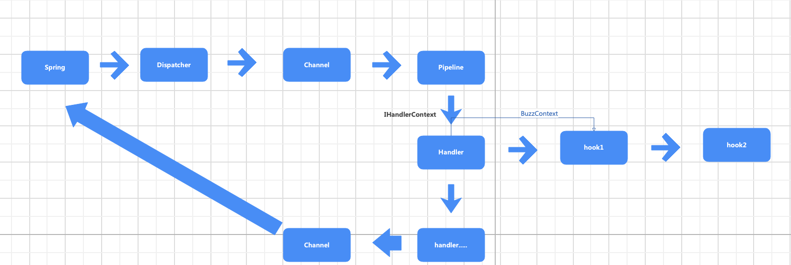
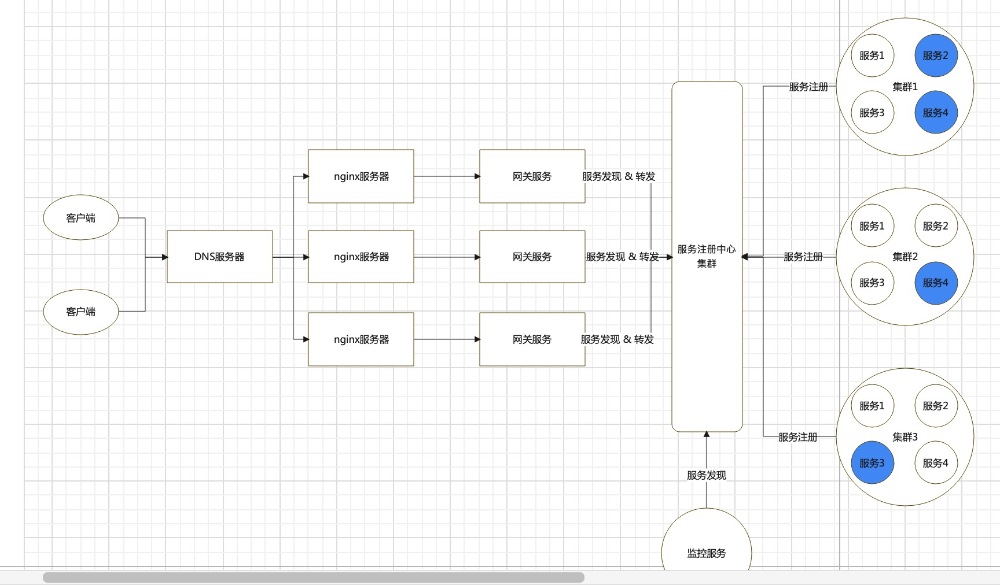

# What
- Java 版的cell 框架
- 这能做什么? 这取决于你想做什么,插件化的设计取决于自身
# TODO

- [x] http
- [x] gateway
- [x] prometheus
- [x] rpc
- event: 后续会重构,写的不好
- discovery: 重构,写的不好
- db
- 一些遗留问题
  - extension 并不是都是需要注入为bean的
  - clean cache

# BUG
- 当extension中通过plugin注解注册的时候,会发现 其他实例可能会无法autoplugin ,使用@Bean注解就行

# 简单设计
- 数据流转:
      - 

# example
- cell-demo/cell-demo-http3 下 
  - 简单架构图 
    - 

  - ```
    1. 先 git clone 该整个仓库
    2. cd cell-demo
    3. cd cell-demo-http3
    4. 把里面一些写死的ip修改了,如: 172.224.2.2 等修改了
    3. ./startAll.sh
    4. 因为注册只会注册一次,并且也没有提供后门, 所以可能会出现服务先比nacos 启动,所以这时候,服务restart 即可
       (并且,用自己的虚拟机试了下,发现基本上是必现的,所以基本上,都得 restart 一下,除了prometheus 和nacos)
    
    /get 
    /rpc 
    即可,还有几个接口,忘了
    限流因为只设置为了2,所以 并发2个请求,就会触发限流
    ```
   
  - 

# feature

- 统一日志管理
    - 日志采取一个日志,统一格式打印: 如 LOG.info(ModuleInterface ,xxxx)
    - 日志归档: 只需要打开开关(目前默认为关闭,且还没加代码),打开之后,日志根据类型,将统一类型的日志放到同一个文件中,根据
        日志级别也会划分
    - 性能: 未测试
    
- 统一配置文件管理
    - 支持热刷
        - 
            ```.env
            Configuration.getDefault().getAndMonitorConfig
            结合 git 即可实现服务之间的配置自动同步并且热更新
            ```
    
    - 模块化: 
        - 根据不同的module 自定义配置,如 在root.json中定义即可
    
          - ```
            {
              "configs": [
                {
                  "modules": {
                    "public.server.json": "public/server.json",
                    "nacos.properties": "env/shared/discovery/nacos.json",
                    "gateway.properties": "env/shared/gateway/gateway.json",
                    "gateway.metrics.properties": "env/shared/gateway/metrics/metrics.json",
                    "grpc.client.propertoes": "env/shared/rpc/grpc/client.json"
                  },
                  "schema": null
                }
              ]
            }
            ```
    
    - 继承结构
    
        - 配置文件之间可以有继承结构(**粒度为单个file**)
    
        - 有则覆盖,无则层层递归往上找
    
        - 如
    
            - ```
                - config
                	- Default
                	- product-userservice1
                	- product-servervice2
                然后在配置文件中定义:
                "types": {
                    "Default": {
                      "parent": null
                    },
                    "product-userservice1":{
                    	"parent": Default
                    },
                     "product-userservice2":{
                    	"parent": product-userservice1
                    }
                  }
                ```
    
            - 则 product-userservice2 自动拥有 product-userservice1有的配置
    
    - 统一入口/出口
    
        - 无论是http,或者是rpc-server 又或者是rpc-client ,业务逻辑自定义,但是框架层,走的都是同一种逻辑
        - 内部的数据流转大致为:
    
    - 自定义注解
    
        - @Plugin=@Bean
        - @ActivePlugin=@Component ...
        - @AutoPlugin=@Autowired
        - @ActiveConfiguration=@Configuration
        - extension 约等于 starter (可插拔,按需加载)
        - 或者在resource 目录下 resources/META-INFO/spring.factories中添加 `com.cell.node.spring.initializer.CellSpringInitializer`实现类,既会自动的将有该注解的类,添加到处理缓存中
            - 然后再自定义 `AbstractBeanDefiinitionRegistry` 实现类即可 
            - `wip:这2步后续会合到一块`
    
    - 插件化
    
        - 所有的组件都采用插件化的形式(参考搭积木)
        - 一个完整的业务框架由n个积木构成,而这就是extension的作用,类似于starter ,需要则引入依赖即可
        - 只需要自定义: AbstractSpringNodeExtension 的实现类即可
        - 当前已有的extension
            - http,rpc-client,rpc-server以及对应的服务发现的extension
            - 指标extension
            - prometheus服务发现extension
    
    - 业务隔离
    
        - 通过网关,将服务集群化,网关会自动转发到对应的集群
    
    - 指标监控
    
        - 引入依赖即可
    
            - ```
                   <dependency>
                            <groupId>com.cell</groupId>
                            <artifactId>cell-metrics-extension-common</artifactId>
                            <version>${cell.version}</version>
                        </dependency>
                ```
    
            - `这个其实并没有好好的测试过`
    
    - 便携式pipeline
    
        - 只需要 @Manager和@ManagerNode 两个注解,即可组合n个pipeline(内部逻辑采用的是reactor-core)

# 使用方法

- 前提

  - 添加repository

    ```
     <repository>
                <id>itsfunny.github.io</id>
                <name>charlie-cell</name>
                <url>https://itsfunny.github.io/maven_repository/maven-repo/</url>
    </repository>
    ```

  - 有一个统一的配置文件

    - 在config/Default/public/server.json中,内部定义了具体服务的端口号信息,公网相关信息等(因为完全可能在docker上跑)
    - 如果不定义,有对应的默认值, http为8000,rpc 为7000,gateway为9999

- 注意

  - reactor 是会作为bean 注入到spring中,而cmd 不会
  - 相关命令行: 
    - -nodeId: 服务名称: 不可为空, 框架通过配置找这个服务相关的端口号(可以不在配置文件中配置,会走默认,但是这个命令行必须要有)
    - -cluster: 标识在哪个集群,允许为空

## http

- 1. 添加依赖

     ```
      <dependency>
     			<groupId>com.cell</groupId>
     			<artifactId>cell-http-extension</artifactId>
     			<version>${cell.version}</version>
     </dependency>
     ```

  2. 编写reactor

     - ReactorAnno
     - 继承AbstractHttpDymanicCommandReactor

     ```
     @ReactorAnno(group = "/reactor1")
     public static class Reactor1 extends AbstractHttpDymanicCommandReactor
     {
             @AutoPlugin
             private IHttpDispatcher commandDispatcher;
             @AutoPlugin
             private LogicImpl logic;
     }
     ```

  3. 添加对应的command

     - 添加注解: @HttpCmdAnno

     - > uri: 就是uri,支持通配符形式,如 /demo/{name}
       >
       > requestType: get or post
       >
       > buzzClz: 框架层会自动解析成buz对象
       >
       > reactor:属于哪个reactor

     - 继承AbstractHttpCommand,然后编写自己的业务逻辑

       - ```
         @HttpCmdAnno(uri = "/cmd3",
                     buzzClz = Cmd3Buz.class,
                     requestType = EnumHttpRequestType.HTTP_URL_GET, reactor = Reactor3.class)
         public static class cm3 extends AbstractHttpCommand
         {
                 @Override
                 protected void onExecute(IHttpCommandContext ctx, Object bo) throws IOException
                 {
                     Cmd3Buz c = (Cmd3Buz) bo;
                     ctx.response(this.createResponseWp().ret(123).build());
                 }
         }
         ```

---

## rpc-server

- 1. 添加依赖

     ```
       <dependency>
     	  <groupId>com.cell</groupId>
       	<artifactId>cell-rpc-grpc-server-extension</artifactId>
     	  <version>${cell.version}</version>
      </dependency> 
     ```

  2. 编写reactor

     - 添加注解 @RPCServerReactorAnno

     - 继承AbstractRPCServerReactor

     ```
     @RPCServerReactorAnno
     public static class DemoRPCServerReactor1 extends AbstractRPCServerReactor
     {
     
     }
     ```

  3. 添加对应的command

     - 添加注解: @RPCServerCmdAnno(protocol = "/demo/1.0.0", reactor = RPCServerReactor1.class)

       > protocol  代表的是该cmd 对应的协议,基本格式为 /name/版本号 ,如 /demo/1.0.0 /demo/2.0.0,并没有做校验,后续会做校验
       >
       > reacotr: 则代表属于哪个reacotr, 允许为空
       >
       > buzzClz: 业务类,会自动的通过框架赋值,默认为空,允许为空

     - 继承AbstractGRPCServerCommand 

       > 暂时只提供了grpc ,所以继承这个即可,内部写业务逻辑

     ```
     public static class RPCServerCommand1 extends AbstractGRPCServerCommand
         {	
             @Override
             protected void onExecute(IRPCServerCommandContext ctx, Object o) throws IOException
             {		
             //  do sth...
                 ServerRPCResponse response = new ServerRPCResponse();
                 ctx.response(this.createResponseWp().status(ContextConstants.SUCCESS).ret(response).build());
             }
         }
     ```

----

## rpc-client

- 1. 添加依赖

     ```
      <dependency>
     		<groupId>com.cell</groupId>
     	  <artifactId>cell-rpc-grpc-client-extension</artifactId>
     	 	<version>1.0-SNAPSHOT</version>
      </dependency>
     ```

  2. 定义注解属性 @GRPCClientRequestAnno

     > protocol: 与serverCmd 对应,代表请求的是哪个server
     >
     > async: 同步还是异步形式
     >
     > responseType: 返回类型,框架层自动反序列,不支持基本数据类型(未校验)
     >
     > timeOut: 超时时间,秒为单位

  3. 定义业务对象,这里为了方便,固定业务对象需要实现某个接口ISerializable ,可以直接继承DefaultSelfJsonSerialize

     ```
     @GRPCClientRequestAnno(protocol = "/demo/1.0.0", async = true, responseType = ServerRPCResponse.class)
     public class ClientRequestDemo extends DefaultSelfJsonSerialize
     {
         private String name = "charlie";
     }
     ```

     

  4. (`rpc-client不需要编写command`)编写业务代码

     ```
       @AutoPlugin // 为本地的grpc client
       private ILocalGRPCClientServer im;
       @AutoPlugin // 服务发现版的grpc client
       private IGRPCNacosClientServer nacosClientServer;
       ClientRequestDemo demo = new ClientRequestDemo();
       Future<Object> call = im.call(ctx, demo);
       try
       {
         Object o1 = call.get();
         ctx.response(this.createResponseWp().ret(o1).build());
       } catch (Exception e)
       {
         ctx.response(this.createResponseWp().exception(e).build());
     	}	
     ```

---

## 服务发现

- 添加对应的extension即可

  - http

    - ```
      <dependency>
                  <groupId>com.cell</groupId>
                  <artifactId>cell-discovery-nacos-http-extension</artifactId>
                  <version>${cell.version}</version>
              </dependency>
      ```

    - 

  - rpc-server

    - ```
       <dependency>
                  <groupId>com.cell</groupId>
                  <artifactId>cell-discovery-nacos-grpc-server-extension</artifactId>
                  <version>${cell.version}</version>
      </dependency>
      ```

  - rpc-client

    - ```
      <dependency>
                  <groupId>com.cell</groupId>
                  <artifactId>cell-discovery-nacos-grpc-client-extension</artifactId>
                  <version>${cell.version}</version>
      </dependency>
      ```

    - 


